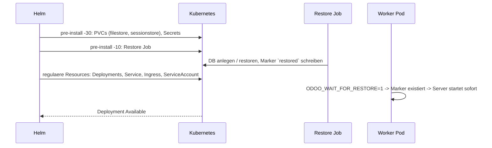
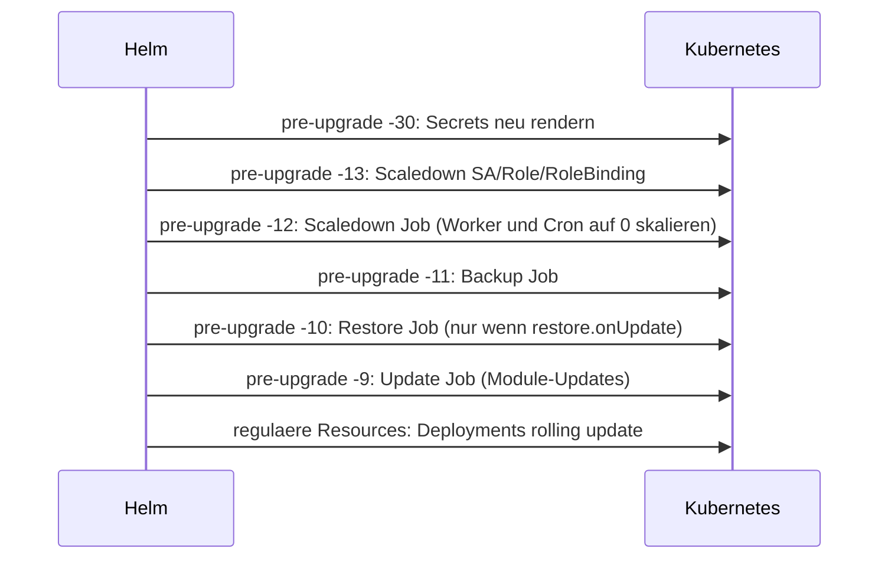
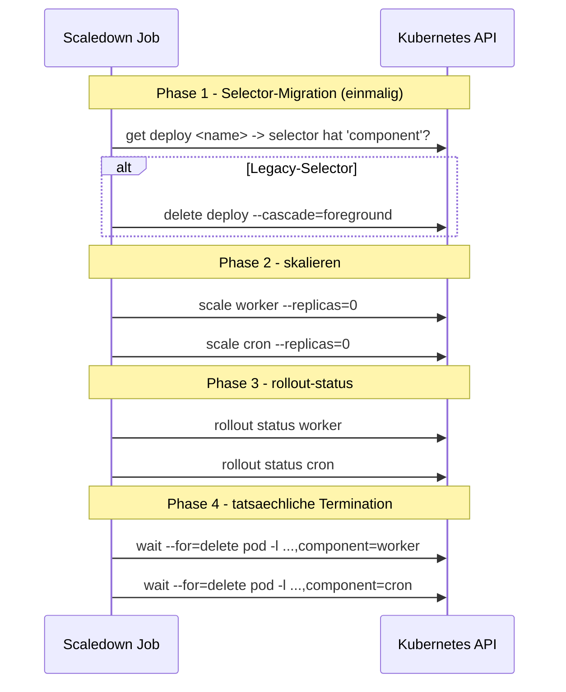

# Agent Instructions – Odoo Helm Chart (`charts/odoo`)

Dieses Dokument beschreibt das **wiederverwendbare Odoo Sub-Chart**, das für jede Odoo-Instanz in einem separaten Wrapper-Chart (`charts/odooi/`) eingebettet wird. Es liefert Agents und Entwickler:innen den Kontext für Anpassungen.

## Verortung im Repo

```
custom-addons-<name>/                       (Subprojekt – pro Odoo-Instanz)
└── charts/
    └── odooi/                              <-- Wrapper-Chart, **pro Instanz** angelegt
        ├── Chart.yaml                      (depends-on: odoo)
        ├── values.yaml                     <-- instanz-spezifische Defaults
        └── charts/
            └── odoo/                       <-- DIESES Sub-Chart, generisch
                ├── Chart.yaml              (depends-on: odooinit)
                ├── values.yaml             (Sub-Chart Defaults)
                ├── templates/              (Runtime-Resources)
                └── charts/
                    └── odooinit/           (Lifecycle-Sub-Sub-Chart)
                        ├── Chart.yaml
                        ├── values.yaml
                        └── templates/
```

- **`charts/odooi/`** wird pro Odoo-Instanz angelegt (z. B. Registry, Kunde A, Kunde B). Es enthält ausschließlich instanzspezifische Werte (`values.yaml`) sowie Chart-Metadaten und referenziert das Sub-Chart `odoo`.
- **`charts/odooi/charts/odoo/`** (dieses Verzeichnis) ist das **wiederverwendbare** Sub-Chart, das in allen Instanzen identisch sein soll. Änderungen hier wirken auf alle Instanzen.
- **`charts/odooi/charts/odoo/charts/odooinit/`** kapselt Lifecycle-Tasks (PVCs, Secrets, Restore, Backup, Update, Scaledown).

Werte aus `odooi/values.yaml` werden via Helm Sub-Chart-Mechanik durchgereicht. Beispiel:

```yaml
# odooi/values.yaml (instanzspezifisch)
odoo:
  replicaCount: 2
  hosts:
    - odoo.example.com
  odooinit:
    pgHost: postgres.svc
    pgDatabase: odoo_kunde_a
    restore:
      enabled: true
```

## Inhalt dieses Sub-Charts

### `templates/` – Steady-State-Resources

| Datei | Zweck |
|---|---|
| [`deployment-worker.yaml`](templates/deployment-worker.yaml) | HTTP-Worker (Odoo `serve`), Probes, optional `ODOO_WAIT_FOR_RESTORE` |
| [`deployment-cron.yaml`](templates/deployment-cron.yaml) | Cron-Worker (separat von HTTP-Workern), nur wenn `workers > 0 && cronThreads > 0` |
| [`service.yaml`](templates/service.yaml) | ClusterIP Service (HTTP + WebSocket) |
| [`ingress.yaml`](templates/ingress.yaml) | Optionaler nginx-Ingress mit Cloudflare/cert-manager Support |
| [`ingress-route-traefik.yml`](templates/ingress-route-traefik.yml) | Optionale Traefik IngressRoute |
| [`cert-manager.yml`](templates/cert-manager.yml) | Optionales `Certificate` für cert-manager |
| [`hpa.yaml`](templates/hpa.yaml) | Horizontal Pod Autoscaler |
| [`serviceaccount.yaml`](templates/serviceaccount.yaml) | ServiceAccount für die Pods |

### `charts/odooinit/templates/` – Lifecycle-Resources

| Datei | Hook | Weight | Bedingung |
|---|---|---|---|
| [`pvc.yaml`](charts/odooinit/templates/pvc.yaml) | `pre-install` | `-30` | immer; `resource-policy: keep` |
| [`secret.yaml`](charts/odooinit/templates/secret.yaml) | `pre-install,pre-upgrade` | `-30` | immer |
| [`restore-job.yaml`](charts/odooinit/templates/restore-job.yaml) | `pre-install` und/oder `pre-upgrade` | `-10` | `restore.enabled` bzw. `restore.onUpdate && !setup` |
| [`pre-update-scaledown.yaml`](charts/odooinit/templates/pre-update-scaledown.yaml) | `pre-upgrade` | `-13` (RBAC) / `-12` (Job) | `scaleDown.enabled && !setup` (siehe [Scaledown-Verhalten](#scaledown-verhalten)) |
| [`pre-update-backup.yaml`](charts/odooinit/templates/pre-update-backup.yaml) | `pre-upgrade` | `-11` | `backup.enabled && !setup` |
| [`pre-update.yaml`](charts/odooinit/templates/pre-update.yaml) | `pre-upgrade` | `-9` | `update.enabled && !setup` |
| [`backup-job.yaml`](charts/odooinit/templates/backup-job.yaml) | reguläre `CronJob` | – | `backup.enabled && backup.schedule` |

## Lifecycle-Reihenfolge

### Initial-Install (`helm install` / Flux `HelmRelease` Reconcile)



### Upgrade (`helm upgrade`)



PVCs werden bewusst **nicht** als `pre-upgrade` Hook angelegt, damit Filestore und Sessionstore über Upgrades persistent bleiben.

## Restore-Verhalten

Gesteuert über `odooinit.restore.*`:

| Wert | Effekt |
|---|---|
| `enabled: true`, keine Pfade | Frisches DB-Init via `odoo serve --stop-after-init`, Marker geschrieben. Geeignet für leere Erstinstallation. |
| `enabled: true`, `databasePath` und/oder `filestorePath` | Restore aus dem angegebenen Pfad (lokal oder `kube://`-URL) vor dem ersten Worker-Start. |
| `onUpdate: true` | Bei jedem Upgrade wird zusätzlich vor dem Update-Job restored (z. B. um die Produktiv-DB in Staging zu spiegeln). |
| `enabled: false`, `onUpdate: false` | Restore-Job wird nicht gerendert. Nutzer ist selbst verantwortlich für DB-Bootstrapping. |

Der Worker liest beim Start den Marker `/data/filestore/<db>/restored`. Solange dieser fehlt und `ODOO_WAIT_FOR_RESTORE=1` gesetzt ist, blockiert `serve.py` (siehe [`addons-oerp/oerp_util/patch/odoo/cli/serve.py`](../../../../../addons-oerp/oerp_util/patch/odoo/cli/serve.py)). Im neuen Hook-Flow ist der Marker bereits geschrieben, bevor der Worker startet – die Wait-Loop ist Safety-Net für Race-Conditions und für Setups mit langsam mountendem Filestore.

Die Restore-Dauer ist stark variabel und kann bei großen Datenbanken oder Filestores **bis zu einer Stunde oder länger** dauern. Die Job-Laufzeit ist über `restore.activeDeadlineSeconds` begrenzt (Default 2h), und Flux/Helm-Timeouts müssen entsprechend dimensioniert sein – siehe Abschnitt [Restore-Dauer und Timeouts](#restore-dauer-und-timeouts).

## Probes

Dreistufig:

- **`startupProbe`** (`failureThreshold * periodSeconds` = max. Startup-Zeit) – schützt vor zu früh greifender Liveness/Readiness bei ungewöhnlich langem Initial-Start (z. B. großes Modul-Update direkt nach Restore).
- **`livenessProbe`** – Standard-Health-Check, kurze `initialDelaySeconds`.
- **`readinessProbe`** – Standard-Readiness, entscheidet über Service-Endpoint-Aufnahme.

Defaults siehe [`values.yaml`](values.yaml). Der `startupProbe`-Default toleriert ca. 1 Stunde (`periodSeconds: 30`, `failureThreshold: 120`), damit auch im Safety-Net-Fall – Worker-Pod startet neu, während `ODOO_WAIT_FOR_RESTORE` noch auf einen langen Restore wartet – keine vorzeitige Liveness-Killung erfolgt. Im regulären Install-Flow ist der Marker bereits vor Worker-Start geschrieben und der Probe-Erfolg kommt nach Sekunden.

## Pod-Komponenten-Labels und Service-Routing

Worker- und Cron-Pods sind über das Label `app.kubernetes.io/component` voneinander unterscheidbar. Das ist für korrektes Service-Routing, gezielte Scaledown-Waits und externe Tooling (NetworkPolicy, PodMonitor, eigene Selektoren) wichtig.

| Resource | Selector |
|---|---|
| `Deployment <release>-worker` | `name=odoo, instance=<release>, component=worker` |
| `Deployment <release>-cron` | `name=odoo, instance=<release>, component=cron` |
| `Service <release>` | `name=odoo, instance=<release>, component=worker` (HTTP nur zu Workern) |

Vorher teilten Worker- und Cron-Deployment denselben Selector – das Service routete jeden n-ten HTTP-Request auf den Cron-Pod (der mit `workers=0` nur einen Single-Threaded-Master-Prozess fährt) und ein per-Komponente-Wait beim Scaledown war nicht möglich.

### Migration

`Deployment.spec.selector` ist in Kubernetes immutable. Beim ersten Upgrade auf Sub-Chart `odoo-19.4.0` / `odooinit-19.7.0` löscht der Scaledown Job (siehe nächster Abschnitt) die Worker- und Cron-Deployments einmalig automatisch (Phase 1 `migrate_selector`); Helm legt sie anschließend mit dem neuen Selector wieder an. Brief Downtime von ungefähr `terminationGracePeriodSeconds` (Default 30s) plus Pod-Startup.

Bei `scaleDown.enabled: false` muss der Operator das manuell vor dem Upgrade ausführen:

```bash
kubectl delete deployment <release>-worker <release>-cron \
  -n <namespace> --cascade=foreground --ignore-not-found
```

Nach dem ersten Upgrade ist der Migrations-Code ein No-Op.

## Scaledown-Verhalten

Der Scaledown-Hook (`pre-upgrade`, Weight `-13`/`-12`) skaliert Worker- und Cron-Deployment vor `backup`/`restore`/`update` Hooks auf 0 und stellt sicher, dass keine Odoo-Prozesse mehr DB-Verbindungen halten.



Konfiguration in [`charts/odooinit/values.yaml`](charts/odooinit/values.yaml):

```yaml
scaleDown:
  enabled: true                    # bei false: gar kein Scaledown-Hook
  timeout: 120                     # Sekunden, gilt fuer JEDE Phase einzeln
  image:
    repository: bitnami/kubectl
    tag: latest
```

Wichtige Eigenschaften:

- **Timeout pro Phase**: `scaleDown.timeout` wird sowohl an `kubectl rollout status`, `kubectl wait --for=delete` als auch an `kubectl delete --timeout` weitergereicht. Der Job kann also im Worst Case `4 * timeout` Sekunden brauchen.
- **Per-Komponente-Wait**: dank des `component`-Labels werden Worker- und Cron-Pods getrennt erwartet. Hängt einer der beiden Pods (z. B. wegen langer Cron-Job-Ausführung), bricht der Job mit Exit 1 ab und Helm/Flux brechen das Upgrade kontrolliert ab.
- **Pipefail aktiv**: das Script aktiviert `set -o pipefail` (sofern die Shell es unterstützt), damit zukünftige Pipeline-Fehler nicht mehr stillschweigend geschluckt werden – das war der Bug, der in Version <= 19.6.0 dazu führte, dass der Scaledown-Wait nie wirklich gewartet hat.
- **RBAC**: der Hook erstellt einen `ServiceAccount`, eine `Role` mit `apps/deployments` (get/list/watch/patch/**delete**) und `pods` (get/list/watch), sowie ein `RoleBinding`. Das sind die minimal notwendigen Rechte für die vier Phasen.

## TLS via cert-manager und Ingress

Die TLS-Konfiguration ist auf **Multi-Instance-Tauglichkeit im selben Namespace** ausgelegt. Drei Werte sind beteiligt:

| Wert | Default | Effekt |
|---|---|---|
| `certmanager.secretName` | `""` (resolved zu `<release>-tls`) | Name des von cert-manager erzeugten TLS-Secrets UND der `Certificate`-Resource |
| `ingress.tlsSecretName` | `""` (resolved via Helper) | Welcher TLS-Secret-Name in den Ingress-Spec eingetragen wird |
| `ingressroute.tlsSecretName` | `""` (resolved via Helper) | Selbes für Traefik IngressRoute |

Resolution-Cascade (Helper [`odoo.ingress.tlsSecretName`](charts/odooinit/templates/_helpers.tpl)):

1. Wenn `ingress.tlsSecretName` explizit gesetzt -> verwendet diesen Wert
2. Sonst wenn `certmanager.enabled: true` -> verwendet den cert-manager-Secret-Namen (default `<release>-tls`)
3. Sonst leer -> Ingress wird ohne TLS-Block gerendert

### Multi-Instance im selben Namespace

Mehrere Releases (z. B. `odoo-staging` und `odoo-prod` oder zwei Mandanten) im selben Namespace funktionieren mit den Defaults out-of-the-box:

| Release | TLS-Secret | Certificate-Name |
|---|---|---|
| `helm install odoo-staging ./odooi` | `odoo-staging-odoo-tls` | `odoo-staging-odoo-tls` |
| `helm install odoo-prod ./odooi` | `odoo-prod-odoo-tls` | `odoo-prod-odoo-tls` |

Keine Kollisionen, weder bei der Certificate-Resource noch beim Secret. Wenn ein Release `certmanager.secretName: shared-tls` setzt, wird dieser Wert verwendet und teilt das Secret bewusst mit anderen Releases (z. B. wenn ein gemeinsames Wildcard-Zertifikat für mehrere Mandanten genutzt wird).

### Manuelle TLS-Secrets (ohne cert-manager)

Wenn `certmanager.enabled: false`, kann `ingress.tlsSecretName` explizit gesetzt werden, um auf einen manuell verwalteten Secret zu zeigen:

```yaml
certmanager:
  enabled: false
ingress:
  enabled: true
  tlsSecretName: "wildcard-example-com"   # extern verwaltetes Secret
```

Bleibt `ingress.tlsSecretName` leer und cert-manager ist deaktiviert, wird das `tls`-Feld im Ingress-Manifest weggelassen (keine TLS-Termination am Ingress).

### Migration von hardcoded `odoo-tls`

Vor dieser Chart-Version war `odoo-tls` der hardcoded Default für sowohl `certmanager.secretName` als auch `ingress.tlsSecretName`. Beim Upgrade auf eine Release-spezifische Default-Auflösung passiert für bestehende Installationen Folgendes:

- Die alte `Certificate`-Resource `odoo-tls` wird von Helm gelöscht (nicht mehr im Manifest)
- Eine neue `Certificate`-Resource `<release>-odoo-tls` wird erzeugt
- cert-manager beantragt ein neues Zertifikat -> kurze TLS-Downtime (bei Let's Encrypt typischerweise < 2 Min)

Möchte man die Downtime vermeiden oder den alten Namen beibehalten, einfach explizit setzen:

```yaml
certmanager:
  secretName: "odoo-tls"
ingress:
  tlsSecretName: "odoo-tls"   # nur sinnvoll bei genau EINER Instanz pro Namespace
```

### `commonName` ist nun opt-in

`commonName` wird nicht mehr automatisch auf `hosts[0]` gesetzt. Cert-Manager hat das Feld seit v1.x als deprecated markiert, moderne CAs ignorieren es, und es bricht bei Hostnames > 64 Zeichen. Wer es trotzdem braucht (z. B. legacy SOAP-Clients), setzt:

```yaml
certmanager:
  commonName: "odoo.example.com"
```

### Namespace-scoped Issuer

Standard ist `issuerKind: ClusterIssuer`. Für namespace-scoped `Issuer`-Resources:

```yaml
certmanager:
  issuer: "letsencrypt-staging-ns"
  issuerKind: "Issuer"
```

## Restore-Dauer und Timeouts

Ein Restore kann je nach Datenbankgröße, Filestore-Volumen und Storage-Backend-Geschwindigkeit **bis zu einer Stunde oder länger** dauern. Drei Stellen sind davon betroffen und müssen aufeinander abgestimmt sein:

| Stelle | Default | Bedeutung | Wo gesetzt |
|---|---|---|---|
| `restore.activeDeadlineSeconds` | `7200` (2h) | Hartes Timeout des Restore Jobs in Kubernetes | [`charts/odooinit/values.yaml`](charts/odooinit/values.yaml) |
| `startupProbe.failureThreshold * periodSeconds` | `120 * 30 = 3600` (1h) | Maximale Worker-Startup-Zeit, bevor der Pod als ungesund gilt | [`values.yaml`](values.yaml) |
| Flux `HelmRelease.spec.{install,upgrade}.timeout` | `5m` (Flux-Default) | Maximale Wartezeit von Flux/Helm auf Hooks und Resources | HelmRelease YAML außerhalb des Charts |

**Wichtig**: Der Flux-Default von 5 Minuten ist für ernstzunehmende Restores **viel zu kurz** – die HelmRelease würde fehlschlagen, lange bevor der Restore-Hook fertig ist. Daher pro Instanz im HelmRelease ein passendes `timeout` setzen, idealerweise größer als `restore.activeDeadlineSeconds`:

```yaml
spec:
  timeout: 2h               # global default fuer install + upgrade
  install:
    timeout: 2h
    remediation:
      retries: 1            # Restore ist destruktiv; nicht wild retryen
  upgrade:
    timeout: 2h
    remediation:
      retries: 3
```

Größenrichtwerte:

| DB-Dump (komprimiert) | Filestore | empfohlene Werte |
|---|---|---|
| < 500 MB | < 10 GB | Defaults reichen |
| 500 MB – 5 GB | 10 – 100 GB | `restore.activeDeadlineSeconds: 7200`, Flux-`timeout: 2h` |
| > 5 GB | > 100 GB | `restore.activeDeadlineSeconds` und Flux-`timeout` auf gemessene Restore-Zeit + 50 % Puffer; ggf. `startupProbe.failureThreshold` proportional anheben |

Bei `restore.onUpdate: true` blockiert der Restore-Hook jeden Upgrade entsprechend lange – einplanen oder via Maintenance-Window steuern.

## FluxCD Integration

Mit den `pre-install` Hooks für Restore und PVCs/Secrets sind **keine** Sonderkonfigurationen am `HelmRelease` notwendig. Beispiel:

```yaml
apiVersion: helm.toolkit.fluxcd.io/v2
kind: HelmRelease
metadata:
  name: odoo-kunde-a
spec:
  interval: 5m
  # Flux-Default ist 5m; muss > restore.activeDeadlineSeconds sein,
  # sonst bricht Flux den Pre-Install/Pre-Upgrade Restore ab.
  timeout: 2h
  chart:
    spec:
      chart: ./charts/odooi
      sourceRef:
        kind: GitRepository
        name: odoo-distribution
  install:
    timeout: 2h
    remediation:
      retries: 1
  upgrade:
    timeout: 2h
    remediation:
      retries: 3
  dependsOn:
    - name: postgres
      namespace: db
  values:
    odoo:
      replicaCount: 2
      odooinit:
        pgHost: postgres.db.svc.cluster.local
        pgDatabase: odoo_kunde_a
        restore:
          enabled: true
          activeDeadlineSeconds: 7200
```

`disableWait` ist bewusst nicht gesetzt – das ursprüngliche Deadlock zwischen `--wait` und `post-install` Restore wurde durch die Verlagerung des Restores in einen `pre-install` Hook beseitigt. Stattdessen ist nur ein ausreichend großzügiges `timeout` notwendig, siehe Abschnitt [Restore-Dauer und Timeouts](#restore-dauer-und-timeouts).

## Patch-Source-Hinweis

Das identische Sub-Chart wird beim Anlegen neuer Subprojekte aus [`addons-oerp/oerp_util/patch/kubernetes/charts/odoo/`](../../../../addons-oerp/oerp_util/patch/kubernetes/charts/odoo/) per `patch.py` einmalig kopiert (Modus `copy_tree`). Es findet **kein automatischer Sync** statt. Verbesserungen am Sub-Chart `charts/odoo` müssen daher zusätzlich in der Patch-Source gespiegelt werden, sonst übernehmen neue Subprojekte den alten Stand.

Das Wrapper-Chart `charts/odooi` wird hingegen pro Instanz neu angelegt und nicht aus der Patch-Source gespeist.

## Konventionen für Anpassungen

- **Naming**: snake_case in YAML-Keys, kurze beschreibende Namen. Siehe [`.cursor/rules/woa-coding-style.mdc`](../../../../.cursor/rules/woa-coding-style.mdc).
- **Sprache**: Alle `string=`/`help=` Werte und User-facing Texts in **Englisch**. Siehe [`.cursor/rules/english-code.mdc`](../../../../.cursor/rules/english-code.mdc).
- **Versionierung**: `Chart.yaml`-`version` bei jeder Änderung erhöhen (`MAJOR.MINOR.PATCH`):
  - PATCH: reine Template-Korrekturen, keine API-Änderungen
  - MINOR: neue optionale Werte oder Resources
  - MAJOR: Hook-Lifecycle, PVC-Ownership oder andere Breaking Changes (Migrations-Hinweis im Commit-Body)
- **Hook-Weights**: bestehendes Schema beibehalten, neue Hooks zwischen vorhandene Weights einsortieren. Niedrigere (negativere) Weights laufen früher.
- **Annotationen kommentieren**: jede neu hinzugefügte Hook- oder Resource-Policy-Annotation soll im Template kurz begründet werden (siehe `pvc.yaml`).

## Migration: Bestehende Installationen auf Hook-basierte PVCs umstellen

Bis zur Sub-Chart-Version `odooinit-19.5.x` wurden PVCs als reguläre Helm-Resources verwaltet, die Restore-Logik lief als `post-install` Hook. Beim Upgrade auf `odooinit-19.6.0` (bzw. Patch-Source `odooinit-19.5.0`) wandern die PVCs aus dem regulären Manifest in den Hook-Bereich (`pre-install` mit `resource-policy: keep`). Helm erkennt dabei "Resource ist nicht mehr Teil des Manifests" und würde die PVCs **löschen** – inkl. Filestore und Session-Daten.

**Vor dem ersten Upgrade auf die neue Chart-Version pro Release einmalig:**

```bash
kubectl annotate pvc <release>-filestore <release>-sessionstore \
  helm.sh/resource-policy=keep --overwrite
```

Die Annotation signalisiert Helm, die existierenden PVCs in jedem Fall zu behalten – auch wenn sie aus dem Manifest verschwinden. Ab der nächsten Reconciliation übernimmt das neue Chart die PVCs als Hook-Resources, ohne dass die Volumes neu angelegt werden.

Bei FluxCD-Releases empfiehlt sich die Annotation per `kubectl` direkt am Cluster (oder über ein einmaliges `Kustomization`-Patch), nicht über das Chart selbst, damit der Schritt explizit und nachvollziehbar bleibt.

Bei Neuinstallationen ist nichts zu tun – die PVCs werden direkt mit der korrekten Annotation als Hook angelegt.

## Sub-Chart-Werte vs. Wrapper-Werte

Wenn der Wrapper (`charts/odooi/values.yaml`) einen Wert überschreiben soll, gehört der unter den Schlüssel des Sub-Charts:

```yaml
# odooi/values.yaml
odoo:                  # <-- Sub-Chart-Name
  livenessProbe:
    initialDelaySeconds: 60
  odooinit:            # <-- Sub-Sub-Chart-Name
    workers: 4
    restore:
      enabled: true
      databasePath: kube://worker@prod-namespace/data/backup/db.dump.gz
```

Defaults gehören in die Sub-Chart `values.yaml` (dieses Verzeichnis bzw. `charts/odooinit/values.yaml`).
